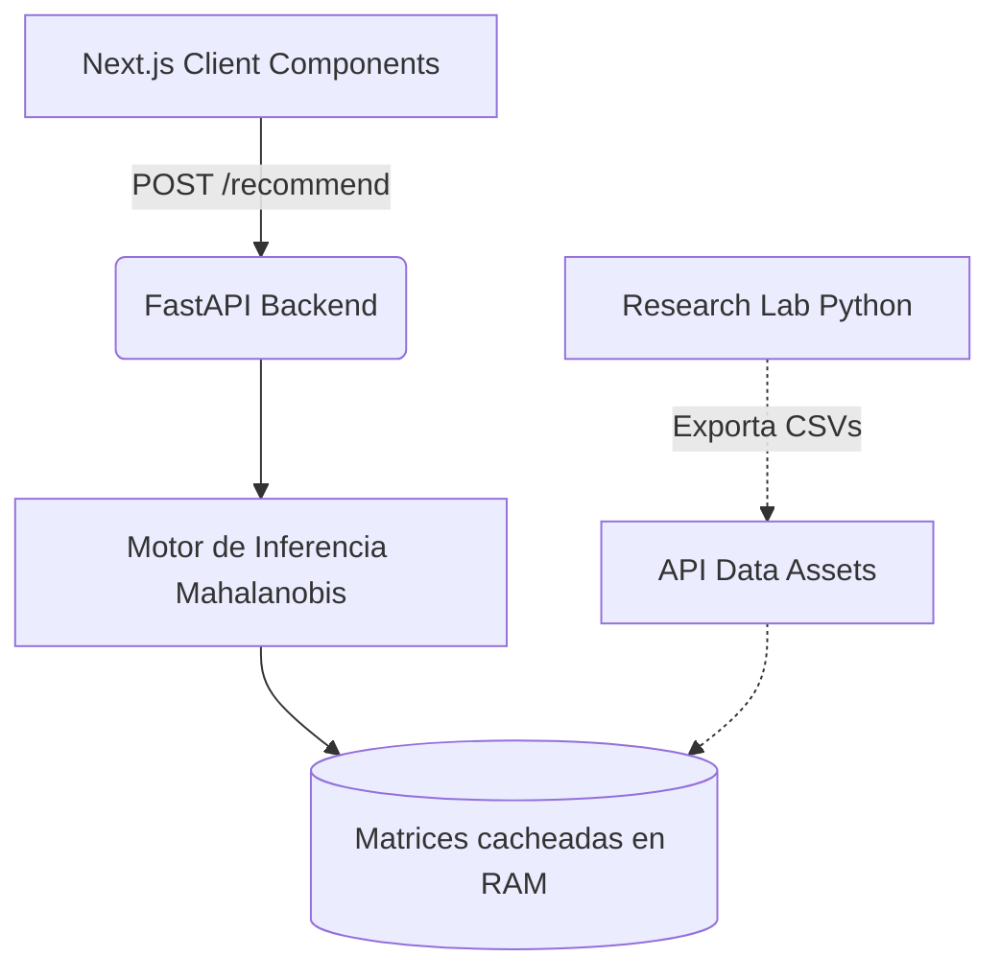

<div align="center">
  <h1>🌌 Mahalanobis Career RecSys</h1>
  <p><strong>Un motor de recomendación vocacional impulsado por Machine Learning y Evaluación Psicométrica Avanzada.</strong></p>

  <p>
    <!-- Dynamic Badges -->
    <a href="https://opensource.org/licenses/MIT"></a>
  </p>
  <p>
    <!-- Tech Stack Badges -->
    
    
    
    
    
  </p>

  <p>
    <a href="#-el-problema">El Problema</a> •
    <a href="#-arquitectura-y-estructura-del-proyecto">Arquitectura</a> •
    <a href="#-decisiones-de-ingeniería">Ingeniería</a> •
    <a href="#-base-psicométrica-riasec--strong--situacional">Psicometría</a> •
    <a href="#-instalación-local">Instalación</a>
  </p>
</div>

---

## 🚀 Sobre el Proyecto

**Mahalanobis Career RecSys** es una aplicación orientada a resolver el problema de la deserción universitaria por mala elección vocacional en las 38 carreras de la Universidad Nacional del Altiplano. 

En lugar de utilizar cuestionarios genéricos y sumatorias simples, el sistema captura un **vector conductual de 12 dimensiones** y lo evalúa utilizando el **Algoritmo de Distancia de Mahalanobis**, logrando una precisión estadística que comprende las correlaciones reales entre habilidades.

<!-- > **Nota:** Inserta aquí un GIF o imagen de tu aplicación funcionando para que los desarrolladores puedan ver el sistema en acción.
> `` -->

---

## 🏗 Arquitectura y Estructura del Proyecto

El proyecto está diseñado como un **Repositorio Multi-Paquete**, desacoplando completamente el análisis de datos, la ingesta del motor ML y el frontend.

```text
mahalanobis-career-recsys/
├── api/             # FastAPI backend (Inferencia stateless y validación Pydantic)
├── client/          # Next.js 16 Client Components (UI y manejo de estado, Tailwind v4)
├── research/        # Pipeline Python (Generación de datos sintéticos y topología de varianza)
└── data/            # Matrices de covarianza exportadas (.csv) listas para consumo
```



---

## 💡 Decisiones de Ingeniería

El sistema fue diseñado priorizando la escalabilidad matemática y la estabilidad en producción.

### 1. Limitaciones de la Distancia Euclidiana frente a QDA
La mayoría de recomendadores calculan la similitud usando *Distancia Euclidiana*. Si un estudiante es brillante en ciencias pero tiene un puntaje atípicamente bajo en física, un enfoque Euclidiano penaliza el perfil simétricamente, alejándolo incorrectamente de áreas STEM.
Implementar un **Clasificador QDA (Análisis Discriminante Cuadrático)** utilizando la Distancia de Mahalanobis resuelve esto. 

> La distancia de Mahalanobis para el vector conductual de un estudiante $\vec{x}$ respecto al perfil promedio de una carrera $\vec{\mu}$ se calcula mediante:
> 
> $$D_M(\vec{x}) = \sqrt{(\vec{x} - \vec{\mu})^T \Sigma^{-1} (\vec{x} - \vec{\mu})}$$
> 
> Donde $\Sigma^{-1}$ representa la matriz de covarianza inversa para esa carrera. El sistema comprende matemáticamente que en ciertas carreras una caída en física es una anomalía contextual permisible siempre que la aptitud matemática general mantenga su correlación.

### 2. Estabilidad Numérica: Pseudo-inversas y Control de Jittering
En espacios vectoriales de alta dimensión (12D), las respuestas de los usuarios pueden presentar colinealidad perfecta, provocando que la matriz de covarianza $\Sigma$ se vuelva singular (no invertible). Para evitar excepciones en tiempo de ejecución:
- **Jittering Estadístico**: El generador de datos inyecta un ruido gaussiano micro-controlado a los vectores de perfil, rompiendo empates matemáticos y dependencias lineales deterministas.
- **Inversión Robusta**: El backend utiliza `scipy.linalg.pinv` (Descomposición en Valores Singulares - SVD) en lugar de una inversión estándar, garantizando la estabilidad algorítmica incluso ante perfiles extremadamente polarizados.

### 3. Inferencia de Tiempo Constante $\mathcal{O}(d^2)$ y Caché en Frío
Invertir 38 matrices de covarianza por cada solicitud HTTP destruiría el *throughput* del servidor. 
Para mitigarlo, **FastAPI** ejecuta la inversión matricial como un proceso *Ahead-of-Time* durante el ciclo de vida `startup`. Las matrices inversas se cargan y se mantienen en la memoria RAM del proceso (`Dict[str, ndarray]`). 

Esto transforma la operación de inferencia de cada usuario en un simple producto punto de vectores que opera en **$\mathcal{O}(d^2)$**, lo que permite:
- **Latencia Sub-10ms**: Resolución casi instantánea del test.
- **Stateless a Nivel de Sesión**: La API es *stateless* respecto a las sesiones de usuario; se pueden desplegar *N* réplicas en contenedores sin necesidad de sincronizar el estado del usuario, utilizando las matrices cacheadas en memoria para absorber picos masivos de solicitudes concurrentes.

---

## 🧠 Base Psicométrica (RIASEC + Strong + Situacional)

El fundamento teórico de este recomendador está anclado en la literatura psicológica de vanguardia, alejándose de los test estáticos de "Me gusta / No me gusta". Hemos integrado:

1. **El Modelo Tipológico de Holland (RIASEC)**: Desarrollado por el psicólogo **John Holland**, evalúa seis dimensiones de la personalidad vocacional (Realista, Investigador, Artístico, Social, Emprendedor, Convencional).
2. **Strong Interest Inventory**: Combinado con dimensiones aptitudinales de liderazgo, practicidad empírica y adopción tecnológica.
3. **Juicio Situacional**: En lugar de preguntar "¿Te gustan las matemáticas?", el test plantea escenarios reales (ej. *"Estás en un trabajo grupal y nadie sabe cómo empezar..."*). Esto reduce drásticamente el sesgo cognitivo de deseabilidad social, capturando la **huella conductual** auténtica del postulante.

---

## ⚙️ Instalación Local

### Prerrequisitos
Para garantizar la consistencia en los entornos de desarrollo, asegúrate de utilizar las versiones adecuadas (apóyate en archivos como `.nvmrc` y `.python-version` incluidos en el proyecto):
- Node.js >= 20.0 y `pnpm`
- Python >= 3.10 y `uv`

### 1. Entorno de Data Science (Pipeline de Datos)
```bash
cd research
uv run data_generator.py
```
> *Nota del Pipeline*: Esto generará los archivos estadísticos base y los enrutará para que la API los consuma como fuente de verdad de las covarianzas.

### 2. Levantar el Motor de Inferencia (API)
```bash
cd api
uv run uvicorn main:app --host 0.0.0.0 --port 8000 --reload
```
> El motor estará escuchando en `http://localhost:8000`. Revisa `http://localhost:8000/docs` para la documentación OpenAPI generada automáticamente.

### 3. Levantar la Interfaz de Usuario (Client)
Abre otra pestaña en la terminal:
```bash
cd client
pnpm install
pnpm run dev
```
> Visita `http://localhost:3000` para iniciar la evaluación vocacional.

---
<div align="center">
  <p align="center">Construido con ❤️ para la comunidad</p>
</div>
