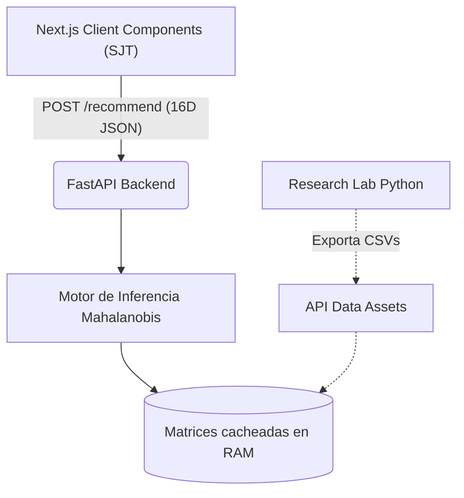

<div align="center">
  <h1>🌌 Mahalanobis Career RecSys</h1>
  <p><strong>Un motor de recomendación vocacional impulsado por Machine Learning y Evaluación Psicométrica Avanzada.</strong></p>

  <p>
    <!-- Dynamic Badges -->
    <a href="https://opensource.org/licenses/MIT"></a>
  </p>
  <p>
    <!-- Tech Stack Badges -->
    
    
    
    
    
  </p>

  <p>
    <a href="#-el-problema">El Problema</a> •
    <a href="#-arquitectura-y-estructura-del-proyecto">Arquitectura</a> •
    <a href="#-decisiones-de-ingeniería">Ingeniería</a> •
    <a href="#-base-psicométrica-riasec--strong--situacional">Psicometría</a> •
    <a href="#-instalación-local">Instalación</a>
  </p>
</div>

---

## 🚀 Sobre el Proyecto

**Mahalanobis Career RecSys** es una aplicación orientada a resolver el problema de la deserción universitaria por mala elección vocacional en las 39 carreras de la Universidad Nacional de la Amazonía Peruana (UNAP). 

En lugar de utilizar cuestionarios genéricos y sumatorias simples, el sistema captura un **vector conductual de 16 dimensiones** (10 de la Educación Básica Regular y 6 Competencias Transversales O*NET) y lo evalúa utilizando el **Algoritmo de Distancia de Mahalanobis**, logrando una precisión estadística que comprende las correlaciones reales entre habilidades.

<!-- > **Nota:** Inserta aquí un GIF o imagen de tu aplicación funcionando para que los desarrolladores puedan ver el sistema en acción.
> `` -->

---

## 🏗 Arquitectura y Estructura del Proyecto

El proyecto está diseñado como un **Repositorio Multi-Paquete**, desacoplando completamente el análisis de datos, la ingesta del motor ML y el frontend interactivo.

```text
mahalanobis-career-recsys/
├── api/             # FastAPI backend (Inferencia stateless y Mahalanobis)
├── client/          # Next.js 16 Client (Test Adaptativo SJT, Tailwind CSS)
├── research/        # Pipeline Python (Perfiles ideales y topología de varianza)
└── data/            # Matrices estáticas exportadas (.csv) listas para consumo
```



---

## 💡 Decisiones de Ingeniería

El sistema fue diseñado priorizando la escalabilidad matemática, la estabilidad en producción y la calidad de los datos entrantes.

### 1. Limitaciones de la Distancia Euclidiana frente a QDA
La mayoría de recomendadores calculan la similitud usando *Distancia Euclidiana*. Si un estudiante es brillante en ciencias pero tiene un puntaje atípicamente bajo en matemáticas, un enfoque Euclidiano penaliza el perfil simétricamente. Implementar la **Distancia de Mahalanobis** resuelve esto. 

> La distancia de Mahalanobis para el vector conductual de un estudiante $\vec{x}$ respecto al perfil promedio de una carrera $\vec{\mu}$ se calcula mediante:
> 
> $$D_M(\vec{x}) = \sqrt{(\vec{x} - \vec{\mu})^T \Sigma^{-1} (\vec{x} - \vec{\mu})}$$
> 
> Donde $\Sigma^{-1}$ representa la matriz de covarianza inversa global. El sistema comprende matemáticamente que en ciertas carreras una caída en áreas específicas es permisible siempre que la aptitud general mantenga su correlación.

### 2. Estabilidad Numérica: Pseudo-inversas y Jittering
En espacios vectoriales de alta dimensión (16D), las respuestas de los usuarios pueden presentar colinealidad. Para evitar excepciones en tiempo de ejecución:
- **Jittering Estadístico**: El generador de datos en `research/` inyecta ruido micro-controlado a los vectores de perfil, rompiendo dependencias lineales deterministas.
- **Inversión Robusta**: El backend utiliza `scipy.linalg.pinv` (Descomposición en Valores Singulares - SVD) en lugar de una inversión estándar de matrices, garantizando la estabilidad algorítmica.

### 3. Inferencia de Tiempo Constante $\mathcal{O}(d^2)$ y Caché en Frío
**FastAPI** ejecuta la carga del CSV estático y la inversión matricial como un proceso *Ahead-of-Time* durante el ciclo de vida `startup`. Las matrices inversas se mantienen en la memoria RAM. 
Esto transforma la operación de inferencia de cada usuario en cálculos vectoriales que operan en **$\mathcal{O}(d^2)$**, lo que permite una **Latencia Sub-10ms** y hace a la API 100% *stateless*.

### 4. Gating Adaptativo (Early-Stopping) en Frontend
Para prevenir el "Test Fatigue", la interfaz en React divide los escenarios en niveles de dificultad (Exploración, Aplicación, Especialización). Si el estudiante escoge vías de acción evasivas en niveles básicos (puntajes $\le 40$), el algoritmo aborta prematuramente esa dimensión y asume incapacidad. Esto protege al sistema del *Efecto Dunning-Kruger*.

---

## 🧠 Base Psicométrica y Situacional

El fundamento teórico de este recomendador está anclado en la literatura psicológica de vanguardia, alejándose de los obsoletos test estáticos de "Me gusta / No me gusta". Hemos integrado:

1. **Competencias Oficiales e Internacionales**: 10 materias de la Educación Básica Regular del Minedu y 6 competencias transversales laborales de la base de datos O*NET (EE.UU.).
2. **Juicio Situacional Puro (SJT)**: El test no contiene afirmaciones vacías, sino **96 escenarios reales estructurados en 5 vías de acción conductual** (desde 20: "Evasión/Pánico" hasta 100: "Liderazgo/Maestría"). Esto reduce drásticamente el sesgo cognitivo de deseabilidad social (*faking*), obligando al estudiante a reflejar su **huella conductual** auténtica.

---

## ⚙️ Instalación Local

### Prerrequisitos
Para garantizar la consistencia en los entornos de desarrollo, asegúrate de utilizar las herramientas modernas recomendadas:
- Node.js >= 20.0 y `npm`
- Python >= 3.10 y `uv`

### 1. Entorno de Data Science (Pipeline de Datos)
```bash
cd research
uv run data_generator.py
```
> *Nota del Pipeline*: Esto generará los archivos estadísticos base (los perfiles de las 39 carreras de la UNAP) y exportará `careers.csv` para que la API lo consuma.

### 2. Levantar el Motor de Inferencia (API)
```bash
cd api
uv pip install -r requirements.txt
uv run main.py
```
> El motor estará escuchando en `http://localhost:8000`. Revisa `http://localhost:8000/docs` para interactuar con los endpoints matemáticos.

### 3. Levantar la Interfaz Psicométrica (Client)
Abre otra pestaña en la terminal:
```bash
cd client
npm install
npm run dev
```
> Visita `http://localhost:3000` para iniciar la evaluación vocacional con SJT.

---
<div align="center">
  <p align="center">Construido con ❤️ para la comunidad</p>
</div>
